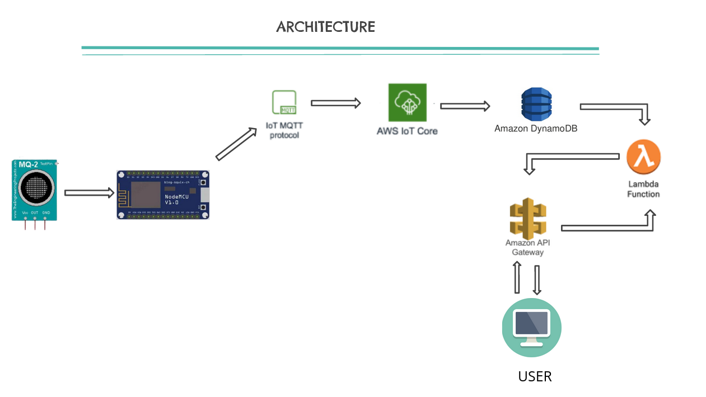
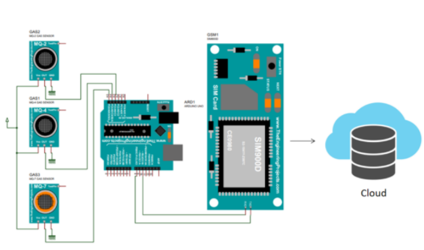

# IoT based Air Quality Monitoring using NodeMCU and MQ2

There have been many incidents like explosions and fire due to certain gases leakage. Such incidents can cause dangerous effects if the leakage is not detected at an early stage. Therefore, Measurement and control of these types of toxic gases present in the environment are essential. Monitoring and analyzing multiple environmental parameters in real-time serves as one of the best solutions for controlling the particular process. A portable system regarding the same in real-time, log data to a remote server, and keeping the data updated over the internet can offer an overview of the process. Gases measurements are in  Parts per Million (PPM) metrics.

